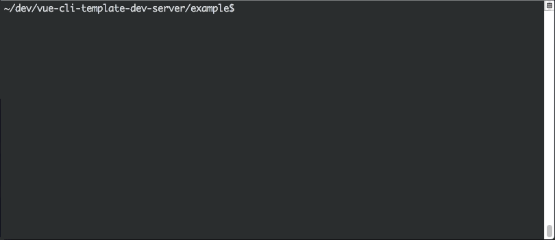

# vue-cli-template-dev-server

*development server for building vue-cli custom templates*

[![NPM][1]][2] [![Mentioned in Awesome Vue][6]][7]


---

<p align="center">
  
</p>


## overview

this package provides a simple, file-watching server to ease the development of [vue-cli custom templates][3].

once started, the server will listen to changes in the app template source files (under the `/template` directory).
when a change is detected, it will re-compile the template to an output directory, allowing live inspection of the 
generated vue.js application.

after the output project is generated, if it's an NPM project, the server will collect its dependencies with `npm i`,
and run `npm run dev` (you can customize which command will run instead of `dev`).


## setup

- install via NPM:
  
  ```sh
  npm i vue-cli-template-dev-server -D
  ```

- add these bits:
  
  *package.json <sup>\*</sup>*
  
  ```json5
  {
    "scripts": {
      "dev": "vue-cli-template-dev-server"
    },
  }
  ```
  
  *.gitignore*
  
  ```gitignore
  out/
  ```
  
<sup>*\* if you don't have a package.json file, run `npm init`.*</sup>


## usage

simply run the dev script:

```sh
npm run dev
```

the server script accepts two optional arguments. the first one is used for overriding the output directory path
(defaults to `out`), and the second for the output project name (`awesome-vue-app`, if not provided).

to use them, either directly run:

```sh
npm run dev -- 'dist/dev-server-out' 'my-app'
```

&hellip; or put them in the package scripts for good:

```json5
{
  "scripts": {
    "dev": "vue-cli-template-dev-server 'dist/dev-server-out' 'my-app'"
  },
}
```

you can also change which NPM script will run on startup (`dev` by default), by passing the
`TARGET_INIT_COMMAND` environment variable:

```sh
env TARGET_INIT_COMMAND='serve' npm run dev -- 'dist/dev-server-out' 'my-app'
```


## CLI

use the `-h` flag to see the manual.

<sup>:ok_hand: ***tip:** to run from the terminal, navigate to the project root directory and run `$(npm bin)/vue-cli-template-dev-server -h`. when installed globally (not recommended), you can just run `vue-cli-template-dev-server -h` from anywhere.*</sup>


## demo

check out the [*/example*][5] directory in this repository for an example usage with the most simple application.
it only contains what's required for the dev-server to work.

to see it in action:

- get a local clone:
  
  ```sh
  cd <workspace-path>
  #   ^ replace this with your local workspace directory
  git clone https://github.com/eliranmal/vue-cli-template-dev-server.git
  ```

- navigate to the demo, and ignite the engines:
  
  ```sh
  cd <workspace-path>/vue-cli-template-dev-server/example
  #   ^ you know the drill
  npm start
  ```

  this will install dependencies, and run the example app's dev server.  
  from now on, if you kill the server, you can run it again with:
  
  ```sh
  npm run dev
  ```

- open *./template/hello.md* and *./out/hello.md* in your editor.

- edit *./template/hello.md* and save your changes.

- see *./out/hello.md* change accordingly.


## kudos

this whole thing started after reading a discussion on [an issue on the vue-cli repository][4], regarding the lack of a *non-interactive* flag.  
after the issue was closed, people started posting some great ideas about how to work around it. i simply pieced the puzzle together.

so thank you, @sobolevn, @paul-hammant, @shailendher, @Harti, @jukefr, @italomaia - who opened this issue in the first place - and everyone involved.

:octocat: :pray: :purple_heart:


[1]: https://img.shields.io/npm/v/vue-cli-template-dev-server.svg?style=flat-square
[2]: https://www.npmjs.com/package/vue-cli-template-dev-server
[3]: https://github.com/vuejs/vue-cli/tree/master#custom-templates
[4]: https://github.com/vuejs/vue-cli/issues/291
[5]: example
[6]: https://awesome.re/mentioned-badge-flat.svg
[7]: https://github.com/vuejs/awesome-vue
